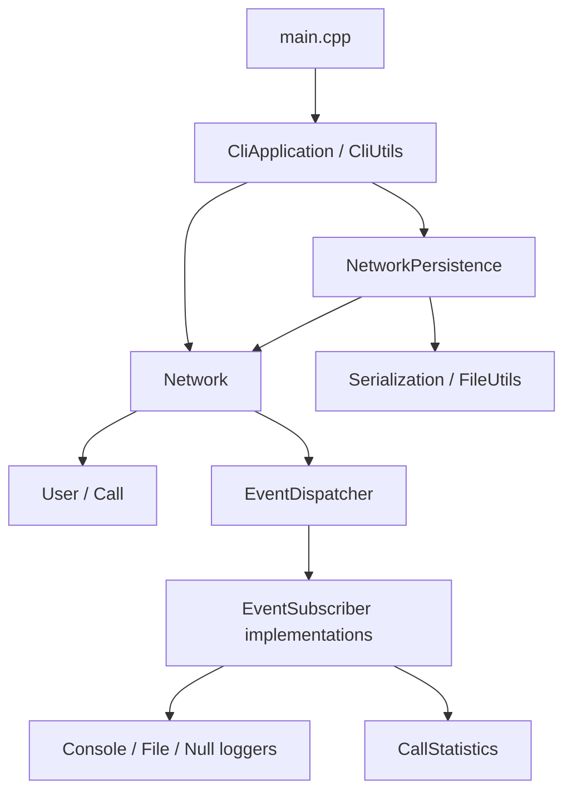

# TelecomSimulator

[](https://github.com/jkxcvj/TelecomSimulator/actions/workflows/ci.yml)

**A C++20 command-line simulator for managing users and the lifecycle of telephone calls.**

Register users, create and control calls, reject conflicting connections, and save or load network records. The project combines a reusable domain library with an interactive CLI, GoogleTest tests, and automated code quality checks.

Built as a personal portfolio project to practice modern C++: ownership and object lifetimes, typed errors, event subscribers, persistence, and testable application design. The simulation models call records and state transitions; it does not transmit audio or implement telecom protocols.

[Quick start](#quick-start) · [Demo](#try-the-demo) · [Architecture](#architecture) · [Development guide](docs/DEVELOPMENT.md)

## Features

- **Call lifecycle:** create, start, and end calls (`Created → Active → Ended`). Reject missing participants, duplicate IDs, self-calls, and attempts to connect busy users.
- **Interactive CLI:** add and remove users, list users and calls, and save or load data through a numbered menu.
- **Text persistence:** serialize users and call states; report malformed records, duplicate IDs, and missing referenced users when loading.
- **Event subscribers:** publish domain events to interchangeable console, file, or null loggers and atomic call counters. The default executable uses a null logger and a statistics subscriber; counters are available through the C++ API.
- **Automated verification:** GoogleTest and CTest, compiler warnings, clang-format, clang-tidy, AddressSanitizer, and UndefinedBehaviorSanitizer.
- **Distribution:** CMake install rules, a CPack `.tar.gz` package, and a multi-stage Docker build that runs tests before creating the runtime image.

## Quick start

The following commands target Linux / WSL. You need a C++20 compiler, CMake 3.20+, Git, and clang-format. CMake downloads GoogleTest v1.17.0 on first configuration, so initial setup requires network access.

On Ubuntu, install the build tools:

```bash
sudo apt-get update
sudo apt-get install -y build-essential cmake git clang-format
```

Clone, build, and run:

```bash
git clone https://github.com/jkxcvj/TelecomSimulator.git
cd TelecomSimulator
cmake -S . -B build -DCMAKE_BUILD_TYPE=Release
cmake --build build --parallel 2
ctest --test-dir build --output-on-failure
./build/TelecomSimulator
```

The application displays a numbered menu. Choose `0` to exit; end-of-input also exits cleanly.

## Try the demo

Run from the repository root:

```bash
./build/TelecomSimulator < examples/demo-input.txt
```

The script registers Alice, Bob, and Charlie and creates two calls. It starts Alice's call to Bob, rejects her second connection while she is busy, and then ends the first call.

Selected output (menus and prompts omitted; record order may vary):

```text
Call created
Call created
Call started
User is busy
Call ended
Calls:
101 | caller=1 | receiver=2 | Ended
102 | caller=1 | receiver=3 | Created
```

For an interactive persistence demo, launch the application, choose `9` (Load), and enter `examples/sample-network.txt`. Choose `6` or `7` to inspect the loaded records, then `8` to save them to a file of your choice.

Loading **merges records into the current network**. Loading the same file twice reports duplicate IDs. Start a new application session to load into an empty network.

### Save format

```text
USER|1|Alice|111111111
USER|2|Bob|222222222
CALL|101|1|2|Ended
```

Fields are separated by `|`; names and phone numbers should not contain `|` or line breaks. Save files have no format version or escaping mechanism yet.

## Architecture



`telecom_core` is a library linked by both the CLI executable and the test executable. Input and output streams are injected into `CliApplication`, allowing command sequences to be tested without a terminal.

| Design choice | Purpose and tradeoff |
|---|---|
| Strong `UserId` and `CallId` types | Prevent accidental mixing of identifiers at compile time. |
| `std::unordered_map` storage | Average constant-time ID lookup; checking whether a user is busy currently scans call records. |
| `std::variant` result types | Make call creation/start and persistence failures explicit without using exceptions for those expected errors. Some simpler operations return `bool`. |
| Value-owned records and a move-only `Network` | Give domain objects a clear owner and prevent implicit network copies. |
| `std::weak_ptr` event subscriptions | Let subscribers expire without the dispatcher extending their lifetime. The application retains the owning `shared_ptr`s. |
| Separate serialization and file access | Keep storage code outside the call model and test parsing independently. |

Useful entry points: [Network](include/Network.h), [CLI](src/CliApplication.cpp), [persistence](src/NetworkPersistence.cpp), and [event dispatcher](src/EventDispatcher.cpp).

## Tests and CI

```bash
ctest --test-dir build --output-on-failure
cmake --build build --target format-check
```

Over 200 tests cover domain rules and invalid state transitions, identifiers, ownership and copy/move behavior, event subscriptions, persistence errors and round trips, and CLI interactions. Additional exercises cover templates, containers, design patterns, and concurrency primitives.

[GitHub Actions](.github/workflows/ci.yml) runs three jobs for pushes and pull requests to `main`:

| Job | Checks |
|---|---|
| Release | Warnings as errors, formatting, build, tests, and the scripted CLI demo |
| Sanitizers | Debug build and tests with ASan and UBSan |
| Clang-Tidy | Static analysis during compilation, warnings as errors, and tests |

See the [development guide](docs/DEVELOPMENT.md) for local sanitizer, analysis, and packaging commands.

## Docker

```bash
docker build -t telecom-simulator .
docker run --rm -it telecom-simulator
```

Keep standard input open because this is an interactive program. To replay the demo:

```bash
docker run --rm -i telecom-simulator < examples/demo-input.txt
```

Files saved inside a removed container are discarded. Mount a directory if you need persistent save files:

```bash
mkdir -p saves
docker run --rm -it -v "$PWD/saves:/data" telecom-simulator
```

Choose Save and enter `/data/network.txt`.

## Repository layout

```text
include/             Domain interfaces and supporting C++ exercises
src/                 Domain implementation, persistence, and CLI
tests/              GoogleTest suites
examples/            Scripted demo, sample data, and sanitizer exercises
docs/                Development and portfolio notes
.github/workflows/   CI configuration
k8s/                 Experimental interactive-container deployment
CMakeLists.txt       Build, tests, formatting, install, and packaging
Dockerfile           Multi-stage build and runtime image
```

## Scope and next steps

The application is a single-process, in-memory simulation with file persistence. `Network` and `EventDispatcher` are intended for single-threaded use; atomic statistics and concurrency exercises do not make the domain API thread-safe. The design-pattern and concurrency exercises are tested separately and are not all part of the CLI workflow.

The Kubernetes manifest is an educational deployment example using a locally supplied image. The CLI has no HTTP endpoint, service API, or readiness probe.

Future improvements:

- Strengthen persistence validation, add format versioning, and make loads transactional.
- Define user-removal rules for users referenced by existing calls.
- Add code coverage reporting and benchmarks before making performance claims.
- Add an index for active calls if measurements justify it.
